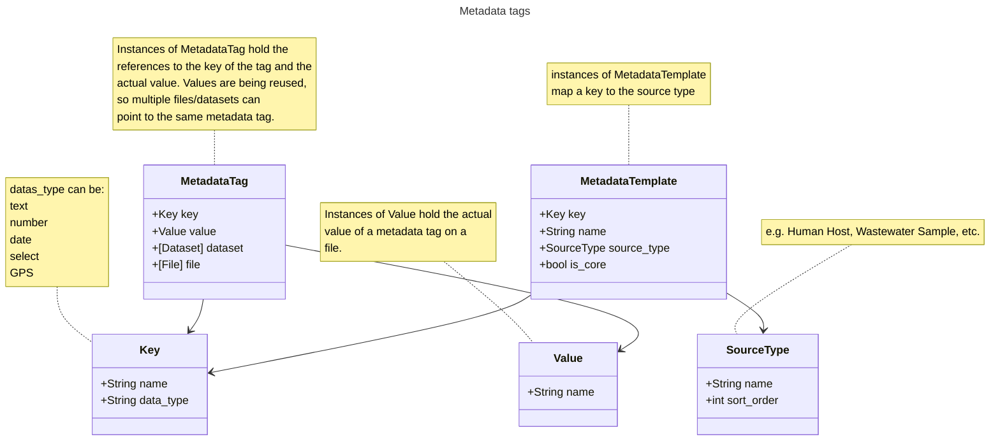

# Understanding Data Models

Welcome to the Data Models reference guide. APGAP is built on a modular architecture composed of several distinct classes, each designed to handle specific data entities and logical operations.

To ensure clarity and ease of navigation, we have documented these classes separately for each component of the applicatiopn. This granular approach allows you to focus on the specific data structures relevant to your current integration task without navigating through unrelated schemas.

## Metadata Data Model

The Metadata Data Model is used to add metadata tags to sequence files. Each tag consists of a key and a value. Platform Administrators can add and edit metadata keys and define what type of value a key has.  

