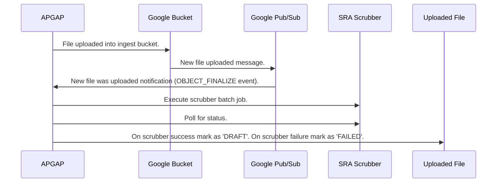

# Cleaning Uploaded Sequence Files

## Google's DLP Scan

Google Cloud Sensitive Data Protection (referred to hear as DLP Scan) is a Google service used to discover, classify, and protect sensitive data. Uploaded sequence files are sent to the DLP Scan to prevent files with sensitive information to be persisted. 

## The SRA Scrubber

The SRA Scrubber is a "tool that takes as input local fastq file from a clinical infection sample, identifies and removes any significant human read, and outputs the edited (cleaned) fastq file that can safely be used for SRA submission." (https://github.com/ncbi/sra-human-scrubber). Fastq files uploaded into APGAP are processed by this tool to ensure any human read fragments in the uploaded files are being removed before storage. When a file is uploaded into APGAP, the tool is executed on the file, and after it scrubbed the file, the scrubbed file is moved to longterm storage.

The workflow is as follows:

Files ingested through the GUI are uploaded into a common Google bucket (`raw-ingest-...` bucket). Files ingested via bulk upload are put into buckets created for a specific bulk upload. Buckets write to a topic in the pub/sub Google product for the `OBJECT_FINALIZE` event (which happens when a file has been successfully uploaded). On the submission of a new message to the topic, pub/sub calls the `IngestNotificationViewSet` endpoint, which will trigger Google's DLP scan (check for Personally Identifiable Information) on the file as well as the SRA scrubber in a celery task.